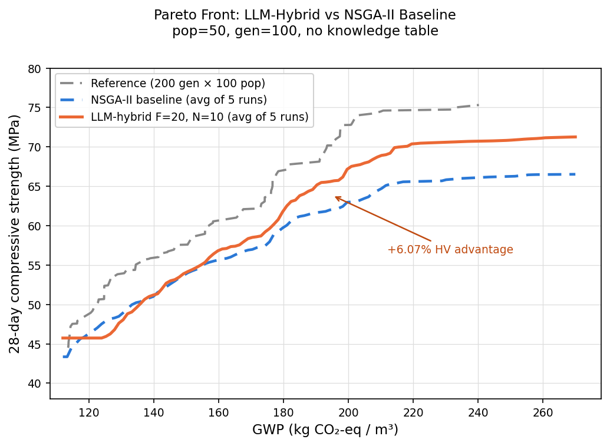
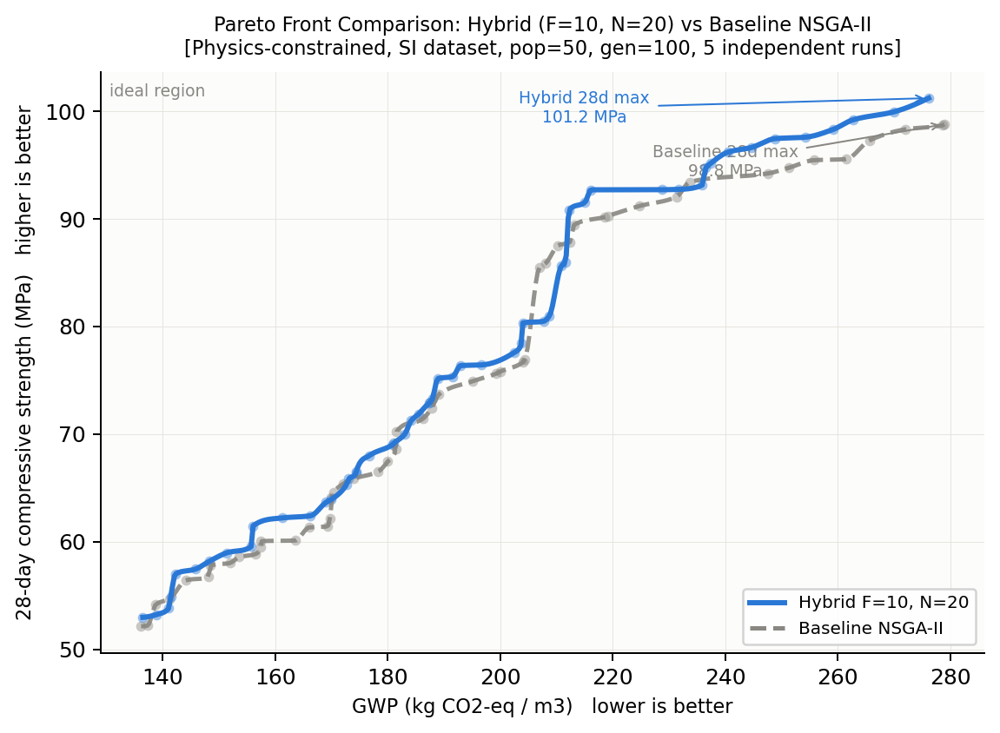
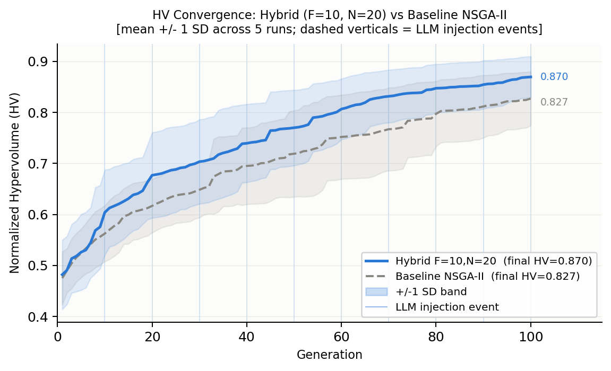

# Multi-Target Concrete Mix Design via LLM Pareto Search

Extends LLM-based concrete mix design from single-objective optimization to **true multi-objective Pareto optimization**: simultaneously minimizing GWP and maximizing 28-day compressive strength. Two approaches are compared — a standalone LLM Pareto explorer (Phase 1) and an LLM-augmented NSGA-II hybrid (Phase 2) — both benchmarked against a pure NSGA-II baseline.

---

## Table of Contents

1. [Research Design](#research-design)
   - [Problem Formulation](#problem-formulation)
   - [Constraints](#constraints)
   - [Surrogate Model](#surrogate-model)
2. [Phase 1: Prompt Strategy Ablation](#phase-1-prompt-strategy-ablation)
   - [Experiment Design](#experiment-design)
   - [Phase 1 Results](#phase-1-results)
3. [Phase 2: LLM-NSGA-II Hybrid Optimizer](#phase-2-llm-nsga-ii-hybrid-optimizer)
   - [Architecture](#architecture)
   - [Hyperparameter Grid Search](#hyperparameter-grid-search)
   - [Phase 2 Results — Physics Constrained](#phase-2-results--physics-constrained)
   - [Statistical Significance](#statistical-significance)
4. [Evaluation Metrics](#evaluation-metrics)
5. [Repository Structure](#repository-structure)
6. [Setup and Usage](#setup-and-usage)
7. [Related Work](#related-work)

---

## Research Design

### Problem Formulation

**Objectives (two conflicting):**
- **Minimize GWP** (kg CO₂-eq/m³): `GWP = PC×1.048 + FA×0.328 + SC×0.264 + CAGG×0.0037 + FAGG×0.0026`
- **Maximize 28-day compressive strength** (MPa): predicted by CatBoost-Chain surrogate

**Variables (10 raw ingredients, kg/m³):**
`PC`, `FA`, `SC`, `FAGG`, `CAGG`, `WATER`, `AEA`, `WR_HR`, `WR`, `ACC`

**Constraints:** three layers enforced during optimization (all bounds derived from the training dataset, except where noted). See [Constraints](#constraints) below.

A solution **A dominates** solution **B** when:
`A.GWP ≤ B.GWP` AND `A.28d ≥ B.28d` (with at least one strict inequality).

The **Pareto front** is the set of all non-dominated solutions.

---

### Constraints

Optimization constraints are applied in three layers. All bounds are derived from the 756-mix training dataset (`Concrete_Data_SI.csv`, SI units: kg/m³, MPa) unless stated otherwise. Material densities follow Pfeiffer et al. (2024), Table 4.

#### Layer 1 — Raw ingredient bounds

Each of the 10 decision variables is bounded by the observed min/max in the dataset:

| Variable | Description | Dataset min (kg/m³) | Dataset max (kg/m³) |
|----------|-------------|--------------------:|--------------------:|
| PC | Portland cement | 97.3 | 504.3 |
| FA | Fly ash | 0.0 | 162.0 |
| SC | Slag cement (GGBS) | 0.0 | 332.2 |
| FAGG | Fine aggregate (sand) | 473.5 | 1067.9 |
| CAGG | Coarse aggregate | 400.5 | 1364.6 |
| WATER | Mix water | 90.8 | 214.8 |
| AEA | Air-entraining agent | 0.0 | 1.5 |
| WR\_HR | High-range water reducer (superplasticizer) | 0.0 | 4.7 |
| WR | Water reducer | 0.0 | 7.8 |
| ACC | Accelerator | 0.0 | 28.5 |

#### Layer 2 — Derived ratio constraints

Eight dimensionless ratios must stay within their dataset ranges. These prevent physically degenerate mixes (e.g., zero binder, pure-aggregate mixes) without hard-coding domain-specific thresholds.

| Ratio | Formula | Min | Max |
|-------|---------|----:|----:|
| w/b | WATER / (PC+FA+SC) | 0.235 | 0.714 |
| b/a | (PC+FA+SC) / (FAGG+CAGG) | 0.105 | 0.488 |
| SCM% | (FA+SC) / (PC+FA+SC) | 0.000 | 0.765 |
| CAGG% | CAGG / (FAGG+CAGG) | 0.315 | 0.721 |
| FAGG% | FAGG / (FAGG+CAGG) | 0.279 | 0.685 |
| PC% | PC / (PC+FA+SC) | 0.235 | 1.000 |
| FA% | FA / (PC+FA+SC) | 0.000 | 0.375 |
| SC% | SC / (PC+FA+SC) | 0.000 | 0.717 |

#### Layer 3 — Physics constraints

Four constraints derived from physical principles and material densities (Pfeiffer et al. 2024, Table 4). Bounds are taken from the dataset distribution.

| Constraint | Formula | Min | Max | Physical meaning |
|------------|---------|----:|----:|-----------------|
| `solid_vol` | Σ(massᵢ / ρᵢ) for all 10 ingredients | 0.753 m³/m³ | 1.034 m³/m³ | Total solid volume cannot exceed 1 m³; remainder is air |
| `Vagg` | (FAGG + CAGG) / 2650 | 0.413 m³/m³ | 0.778 m³/m³ | Volume of aggregates in the mix (ρFAGG = ρCAGG = 2650 kg/m³) |
| `TOTAL_BINDER` | PC + FA + SC | 207.7 kg/m³ | 590.3 kg/m³ | Total cementitious content; prevents extreme binder reduction that fools the surrogate |
| `ACC_pct` | ACC / (PC+FA+SC) | 0.000 | 0.061 | Accelerator dosage as a fraction of binder; caps surrogate exploitation via extreme ACC |

**Rationale for Layer 3:** Without these constraints, the optimizer exploits the CatBoost surrogate by simultaneously minimizing binder (low GWP) and maximizing accelerator (ACC) to predict high strength — producing mixes with `TOTAL_BINDER` below 170 kg/m³ and `ACC` above 22 kg/m³, both far outside any real-world mix. The physics constraints close this exploitation gap.

---

### Surrogate Model

The CatBoost-Chain surrogate is trained on `Concrete_Data_SI.csv` (756 mixes, native kg/m³) and reused from the companion project [`low_carbon_concrete`](../low_carbon_concrete). It predicts 7-day, 28-day, and 56-day compressive strength via a chained architecture:

```
Stage 1: f(mix features)          → pred_7day
Stage 2: f(mix features, pred_7d) → pred_28day
Stage 3: f(mix features, pred_28d)→ pred_56day
```

**Performance:** 28-day Test R² = 0.923, chained R² = 0.913.  
Model path (relative): `../low_carbon_concrete/concrete_catboost_optimized.pkl`  
Input unit: kg/m³

---

## Phase 1: Prompt Strategy Ablation

### Experiment Design

The LLM (Gemini) iteratively proposes concrete mixes and receives feedback about where each proposal sits relative to the current Pareto front. Five prompt strategies are compared via cumulative ablation — each adds one component on top of the previous:

| ID | Name | Knowledge Table | Nav. Rules | Few-shot | Targeting |
|----|------|:-:|:-:|:-:|:-:|
| E0 | `e0_baseline`   | ✗ | ✗ | ✗ | none |
| E1 | `e1_knowledge`  | ✓ | ✗ | ✗ | none |
| E2 | `e2_rules`      | ✓ | ✓ | ✗ | none |
| E3 | `e3_fewshot`    | ✓ | ✓ | ✓ | none |
| E4 | `e4_gap_target` | ✓ | ✓ | ✓ | gap  |

**Prompt components:**
- **Knowledge Table**: material-level GWP factors and their effect on strength — tells the LLM what each ingredient does.
- **Navigation Rules**: situation-based Pareto strategies (push the low-GWP end, push the high-strength end, fill a gap).
- **Few-shot examples**: 5 real mixes from the dataset spread across the GWP spectrum, showing the LLM realistic trade-off examples.
- **Gap targeting**: each iteration, the LLM is directed toward the largest GWP gap in the current Pareto front.

---

### Phase 1 Results

NSGA-II reference: **98 Pareto solutions**, GWP 113.6–240.3 kg/m³, 28d 44.5–75.3 MPa, **HV = 23,859**

| Experiment | HV | HV ratio | GD ↓ | IGD ↓ | Non-dom rate | Parse fails |
|------------|------|----------|-------|-------|:---:|:---:|
| NSGA-II (ref) | 23,859 | 1.000 | — | — | — | — |
| E0 baseline | 13,389 | 0.561 | 0.381 | 0.395 | 30% | 32 |
| E1 +knowledge | 12,683 | 0.532 | 0.479 | 0.381 | 27% | 49 |
| E2 +rules | 13,631 | 0.571 | 0.518 | 0.365 | 40% | 30 |
| **E3 +fewshot** | **15,259** | **0.640** | **0.320** | **0.283** | 13% | 60 |
| E4 +gap-target | 12,915 | 0.541 | 0.616 | 0.468 | 30% | 66 |

**Key findings:**
- **E3 (few-shot) achieves the best HV, GD, and IGD** — real historical examples are more effective than textual rules alone for guiding Pareto exploration.
- **E1 (knowledge table alone) slightly degrades performance** — the longer prompt increases parse failures without providing actionable Pareto navigation guidance.
- **E4 (gap-targeting) performs poorly** — with only 30 iterations, the Pareto front is too sparse for gap-filling to be effective; the LLM over-focuses on narrow regions.
- **Parse failures are consistently high (30–66)** across all experiments — an inherent cost of complex prompts in structured-output tasks.

---

## Phase 2: LLM-NSGA-II Hybrid Optimizer

Rather than replacing NSGA-II with the LLM, Phase 2 **injects LLM-proposed solutions into a running NSGA-II loop**. Every F generations, the top Pareto-elite solutions are sent to Gemini; the LLM returns N new candidate mixes that are inserted into the offspring pool before environmental selection.

### Architecture

```
NSGA-II generation loop
  ├── SBX crossover + polynomial mutation  →  offspring
  ├── every F generations:
  │     elite solutions → LLM prompt → N new candidates
  │     replace worst N offspring with LLM candidates
  └── fast non-dominated sort + crowding distance → next population
```

Injection timing: the first LLM call occurs at generation F (not at gen 0). With F=10, injections occur at gen 10, 20, 30, …, 100 (10 calls total per run). The HV recorded at each of those generations already includes the injected solutions.

---

### Hyperparameter Grid Search

A 3×3 grid over injection frequency F ∈ {5, 10, 20} and injection size N ∈ {5, 10, 20} was run with pop=50, gen=100, 5 repeats per cell (90 total runs).

#### Pre-constraint results (F=20, N=10)

> **Note:** The result below was produced **before** the Layer 3 physics constraints were added. The optimizer exploited the CatBoost surrogate by reducing binder to near-zero and inflating ACC, producing mixes that look good on paper but are physically implausible. It is kept here for historical context.



Each curve is the average of 5 independent runs, computed by linear interpolation across all GWP values. The **reference** curve (gray dashed) shows a longer pure NSGA-II run (200 gen × 100 pop) as an upper bound.

Key findings from the pre-constraint grid:
- **F=20 outperforms F=5/10**: injecting every 20 generations means NSGA-II has more time to evolve a high-quality elite before the first LLM call.
- **N=10 (20% of pop) is the sweet spot**: N=20 causes parse failures (Gemini struggles to generate 20 valid JSON solutions per call), while N=5 provides too little signal.
- **No knowledge table**: providing explicit GWP formulae and domain rules *hurts* performance. The knowledge table biases the LLM toward a narrow region of the Pareto front, reducing diversity and lowering hypervolume.

---

### Phase 2 Results — Physics Constrained

After adding all three constraint layers, the grid was re-run with the surrogate model retrained on `Concrete_Data_SI.csv` (756 rows, native kg/m³) to eliminate the unit-mismatch from the earlier lb/yd³ → kg/m³ conversion. HV is computed in the normalized [0, 1]² objective space using dataset-derived bounds (GWP: 169–534.5 kg CO₂/m³; 28d strength: 17.4–106.1 MPa), making values directly comparable across experiments.

**Grid summary (mean normalized HV % gain, hybrid vs within-cell baseline):**

| | N=5 | N=10 | N=20 |
|---|:---:|:---:|:---:|
| **F=5**  | +1.46% | +0.86% | −4.05%\* |
| **F=10** | +3.53% | +4.30% | **+5.21%**\* |
| **F=20** | −1.11% | −1.23% | −0.77%\* |

\* N=20 averaged 57 / 27 / 13 JSON parse failures per run (Gemini fails to return 20 valid solutions in one call), reducing effective injection count.

| Configuration | Role |
|---|---|
| **F=10, N=20** | Selected best (mean **+5.21% HV**, highest gain; 27 parse failures/run) |
| F=10, N=5 | Best parse-failure-free (mean +3.53% HV, std ±7.72%, zero parse failures) |
| F=20, N=5 | Most stable (mean −1.11% HV, std ±5.44%, only 5 LLM calls/run) |

#### Pareto front: Hybrid vs Baseline (F=10, N=20)



All 5 runs pooled; curves are PCHIP-smoothed non-dominated fronts. The hybrid pushes the high-strength end of the Pareto front: max 28-day strength reaches **101.2 MPa** vs **98.8 MPa** for the baseline (+2.4%). The hybrid also narrows the GWP upper end (hybrid [136.5, 282.6], baseline [136.2, 307.5] kg CO₂/m³), indicating the LLM's injections both raise achievable strength and reduce coverage of high-GWP, low-value mixes.

#### Convergence curves (F=10, N=20)



The hybrid leads from the very first injection (generation 10) and maintains a consistent advantage throughout. Final normalized HV: **0.8696 (hybrid)** vs **0.8273 (baseline)**, a **+5.1% gain**.

**HV gap at each injection checkpoint** (mean across 5 reps, F=10, N=20):

| Generation | Event | Baseline HV | Hybrid HV | Gap (%) |
|:----------:|:------|------------:|----------:|--------:|
| 10  | After injection 1  | 0.5626 | 0.6042 | **+7.39%** |
| 20  | After injection 2  | 0.6169 | 0.6770 | **+9.74%** |
| 30  | After injection 3  | 0.6485 | 0.7036 | **+8.51%** |
| 40  | After injection 4  | 0.6952 | 0.7397 | +6.39% |
| 50  | After injection 5  | 0.7191 | 0.7701 | +7.09% |
| 60  | After injection 6  | 0.7521 | 0.8068 | +7.28% |
| 70  | After injection 7  | 0.7673 | 0.8318 | **+8.40%** |
| 80  | After injection 8  | 0.7974 | 0.8476 | +6.29% |
| 90  | After injection 9  | 0.8118 | 0.8546 | +5.27% |
| 100 | Final              | 0.8273 | 0.8696 | +5.11% |

Unlike smaller N configurations (which show 2–3 generations of disruption before the hybrid advantage emerges), F=10, N=20 shows **a positive gap from the very first injection**. With N=20 solutions injected per call, the LLM's influence is strong enough to immediately shift the population toward higher-quality regions. The gap peaks at **+9.74% at generation 20** and stabilises around +5–7% thereafter.

---

### Statistical Significance

#### Constrained grid (n=5 reps per cell)

Friedman test across 9 hybrid configurations: χ²=9.867, p=0.274 (ns).  
Wilcoxon signed-rank test (paired within each cell, two-sided):

| Configuration | HV baseline | HV hybrid | Δ% | p-value |
|---|:---:|:---:|:---:|:---:|
| F=5,  N=5  | 0.7963 | 0.7982 | +0.24% | 1.0000 |
| F=5,  N=10 | 0.7873 | 0.7859 | −0.18% | 0.6250 |
| F=5,  N=20\* | 0.8344 | 0.7971 | −4.47% | 0.4375 |
| F=10, N=5  | 0.7963 | 0.8219 | +3.21% | 0.4375 |
| F=10, N=10 | 0.7983 | 0.8295 | +3.90% | 0.6250 |
| **F=10, N=20**\* | 0.7972 | **0.8339** | **+4.61%** | 0.8125 |
| F=20, N=5  | 0.8322 | 0.8221 | −1.22% | 1.0000 |
| F=20, N=10 | 0.8556 | 0.8421 | −1.58% | 1.0000 |
| F=20, N=20\* | 0.8491 | 0.8407 | −0.98% | 0.8125 |

\* High parse-failure rate; effective N is much lower than nominal.

> **Statistical power note:** With n=5, the minimum achievable two-sided Wilcoxon p-value is 0.0625. No configuration reaches p<0.05 at this sample size. The reference paper (Lu et al. 2026) used n=10 and achieved p=0.002 for their best config. **Planned: rerun with n=10 reps for publication-grade significance.**

#### Pre-constraint validation (F=20, N=10, n=30 paired runs)

To confirm the HV improvement is not a random artifact, 30 independent repetitions were run and analyzed with three tests:

| Test | Result | Interpretation |
|------|--------|---------------|
| Wilcoxon signed-rank (one-tailed, H₁: hybrid > baseline) | W=326, **p=0.028** | Statistically significant (p<0.05) |
| Cliff's δ effect size | **δ=+0.329** (small) | Hybrid dominates baseline in 66% of paired comparisons |
| Bootstrap 95% CI on mean ΔHV (10,000 iterations) | **[+15, +1,015]** | CI excludes zero — significant |

Hybrid wins in **18 of 30 runs** (60%). Mean HV gain is **+2.75%** (std ±6.78 pp). Despite variance from NSGA-II's sensitivity to random initialization, all three tests confirm the improvement is statistically significant.

> One-tailed Wilcoxon is appropriate here because the hypothesis is directional (the hybrid is designed to improve upon NSGA-II, not merely differ from it), consistent with standard practice in evolutionary computation literature.

---

## Evaluation Metrics

### HV — Hypervolume

Measures the **volume of objective space dominated by the Pareto front**, relative to a fixed reference point. Computed in the normalized [0, 1]² space using dataset-derived bounds:
- GWP: normalized to [0, 1] over [169, 534.5] kg CO₂/m³
- 28d strength: inverted and normalized to [0, 1] over [17.4, 106.1] MPa
- Reference point: [1, 1] (worst-case corner in minimization space)

A larger HV means the front pushes further toward low GWP **and** high strength simultaneously.

### HV ratio = HV(LLM) / HV(NSGA-II)

The fraction of the NSGA-II hypervolume achieved by the LLM.
- `1.0` = LLM matches NSGA-II perfectly
- `0.64` (E3 best) = LLM covers 64% of the NSGA-II objective space

### GD — Generational Distance

Measures how **close the LLM solutions are to the NSGA-II reference front** (LLM → NSGA direction).

```
GD = mean over all LLM Pareto points of: distance to the nearest NSGA-II point
```

- Lower GD = LLM solutions are nearer to the true Pareto front
- Answers: *"Are the LLM solutions high quality?"*

### IGD — Inverted Generational Distance

Measures how **well the LLM front covers the NSGA-II reference front** (NSGA → LLM direction).

```
IGD = mean over all NSGA-II Pareto points of: distance to the nearest LLM point
```

- Lower IGD = the LLM front covers more of the reference front
- Answers: *"Does the LLM explore the full range of the Pareto front, or only part of it?"*

**GD vs IGD:** A front can have low GD (high-quality solutions) but high IGD (only covers one end of the trade-off). Both should be small for a good result.

### Spread

The GWP range covered by the LLM front divided by the GWP range of the NSGA-II front:

```
spread = (max_GWP_llm - min_GWP_llm) / (max_GWP_nsga - min_GWP_nsga)
```

A spread > 1 means the LLM explored a wider GWP range than NSGA-II.

### Non-dom rate

The fraction of LLM proposals that were **non-dominated** (successfully added to the Pareto front at the time of proposal). Higher is better, though a low rate is not always bad — if the LLM finds a few excellent solutions early, later proposals will be dominated by them.

### Parse fails

The number of times the LLM's response **could not be parsed as valid JSON**, requiring a retry. Ideal = 0. Parse failures increase with prompt complexity and reduce effective injection count.

---

## Repository Structure

```
├── optimizer_core_mt.py          # Core multi-objective optimizer
├── optimizer_hybrid_mt.py        # Phase 2 hybrid optimizer
├── run_experiment_mt.py          # Phase 1 ablation runner
├── run_grid_fn_mt.py             # Phase 2 F×N grid search runner
├── recompute_metrics_normalized.py  # Post-processing: recompute normalized HV
├── Concrete_Data_SI.csv          # Dataset (756 mixes, kg/m³)
├── results/
│   ├── nsga2_reference.csv       # NSGA-II Pareto front (shared reference)
│   ├── figures/                  # All generated figures
│   ├── e0_baseline/ … e4_gap_target/   # Phase 1 experiment results
│   ├── grid_base_f??_n??_rep??/  # Phase 2 baseline runs (90 total)
│   ├── grid_hyb_f??_n??_rep??/   # Phase 2 hybrid runs (90 total)
│   └── grid_fn_normalized_*.csv  # Grid summary with normalized HV
└── README.md
```

Each `results/grid_*/` folder contains:
- `hv_history.csv` — HV recorded at every generation (gen 1–100)
- `pareto_front.csv` — final non-dominated solutions
- `metrics.csv` — summary metrics

Each `results/e*/` folder contains:
- `trajectory.csv` — all 30 LLM proposals (dominated + non-dominated)
- `llm_pareto_front.csv` — the final non-dominated set found by LLM
- `nsga_pareto_front.csv` — the NSGA-II reference Pareto front
- `metrics.csv` — evaluation metrics

---

## Setup and Usage

### Installation

```bash
pip install pymoo catboost joblib google-genai python-dotenv pandas numpy scipy
```

Create a `.env` file in the project root:
```
GEMINI_API_KEY=your_key_here
```

### Phase 1 — Ablation experiments

```bash
# Run a single experiment (E0 also generates the NSGA-II reference)
python run_experiment_mt.py --exp e0_baseline

# Reuse saved NSGA-II reference for subsequent runs
python run_experiment_mt.py --exp e3_fewshot --skip-nsga

# Quick test with fewer iterations
python run_experiment_mt.py --exp e0_baseline --iters 5
```

### Phase 2 — Hybrid optimizer grid search

```bash
# Full 3×3 grid, 5 repeats (90 runs — takes several hours)
python run_grid_fn_mt.py

# Single cell, e.g. F=10 N=20 only
python run_grid_fn_mt.py --f-levels 10 --n-levels 20 --repeat 5

# Partial rerun starting from rep 3
python run_grid_fn_mt.py --f-levels 10 --n-levels 20 --rep-start 3 --repeat 3
```

---

## Related Work

This project is part of a two-phase study:
- **Phase 1 (this repo):** LLM as Pareto front explorer — compare prompt strategies vs. NSGA-II baseline.
- **Phase 2 (this repo):** LLM as NSGA-II augmentor — periodic injection of LLM-proposed solutions into the evolutionary loop.

Companion project: [`low_carbon_concrete`](../low_carbon_concrete) — single-objective LLM optimizer (minimize GWP with a 28d strength constraint), Gemini + CatBoost-Chain surrogate.
