# Multi-Target Concrete Mix Design via LLM-Augmented NSGA-II

Simultaneously minimizes GWP (kg CO₂e/m³) and maximizes 28-day compressive strength (MPa) using an **LLM-hybrid NSGA-II** optimizer. Every generation, Gemini proposes 15 new candidate mixes that are appended to NSGA-II's offspring pool before environmental selection. A paired baseline (same seeds, no LLM) runs in parallel for significance testing.

---

## Table of Contents

1. [Research Design](#research-design)
   - [Problem Formulation](#problem-formulation)
   - [Constraints](#constraints)
   - [Surrogate Model](#surrogate-model)
2. [LLM-NSGA-II Hybrid Optimizer](#llm-nsga-ii-hybrid-optimizer)
   - [Architecture](#architecture)
   - [Prompt Design](#prompt-design)
3. [Results](#results)
   - [Step 1 — Statistical Significance](#step-1--statistical-significance)
   - [Step 2 — LLM Solution Quality](#step-2--llm-solution-quality)
   - [Step 3 — Pareto Front Diversity](#step-3--pareto-front-diversity)
   - [Step 4 — Ablation Study](#step-4--ablation-study)
     - [Step 4.1 — Method Comparison](#step-41--method-comparison)
     - [Step 4.2 — Leave-One-Out Prompt Ablation](#step-42--leave-one-out-prompt-ablation)
   - [Step 5 — Physical Interpretation: GWP Drivers](#step-5--physical-interpretation-gwp-drivers-across-the-pareto-front)
4. [Evaluation Metrics](#evaluation-metrics)
5. [Repository Structure](#repository-structure)
6. [Setup and Usage](#setup-and-usage)
7. [Related Work](#related-work)

---

## Research Design

### Problem Formulation

**Objectives (two conflicting):**
- **Minimize GWP** (kg CO₂-eq/m³): `GWP = PC×1.048 + FA×0.328 + SC×0.264 + CAGG×0.0037 + FAGG×0.0026`
- **Maximize 28-day compressive strength** (MPa): predicted by CatBoost-Chain surrogate

**Variables (10 raw ingredients, kg/m³):**
`PC`, `FA`, `SC`, `FAGG`, `CAGG`, `WATER`, `AEA`, `WR_HR`, `WR`, `ACC`

**Constraints:** three layers enforced during optimization (all bounds derived from the training dataset, except where noted). See [Constraints](#constraints) below.

A solution **A dominates** solution **B** when:
`A.GWP ≤ B.GWP` AND `A.28d ≥ B.28d` (with at least one strict inequality).

The **Pareto front** is the set of all non-dominated solutions.

---

### Constraints

Optimization constraints are applied in three layers. All bounds are derived from the 756-mix training dataset (`Concrete_Data_SI_clean.csv`, SI units: kg/m³, MPa) unless stated otherwise.

#### Layer 1 — Raw ingredient bounds

| Variable | Description | Min (kg/m³) | Max (kg/m³) |
|----------|-------------|------------:|------------:|
| PC | Portland cement | 97.3 | 504.3 |
| FA | Fly ash | 0.0 | 162.0 |
| SC | Slag cement (GGBS) | 0.0 | 332.2 |
| FAGG | Fine aggregate (sand) | 473.5 | 1067.9 |
| CAGG | Coarse aggregate | 400.5 | 1364.6 |
| WATER | Mix water | 90.8 | 214.8 |
| AEA | Air-entraining agent | 0.0 | 1.5 |
| WR\_HR | High-range water reducer | 0.0 | 4.7 |
| WR | Water reducer | 0.0 | 7.8 |
| ACC | Accelerator | 0.0 | 28.5 |

#### Layer 2 — Derived ratio constraints

| Ratio | Formula | Min | Max |
|-------|---------|----:|----:|
| w/b | WATER / (PC+FA+SC) | 0.235 | 0.714 |
| b/a | (PC+FA+SC) / (FAGG+CAGG) | 0.105 | 0.488 |
| SCM% | (FA+SC) / (PC+FA+SC) | 0.000 | 0.765 |
| CAGG% | CAGG / (FAGG+CAGG) | 0.315 | 0.721 |
| FAGG% | FAGG / (FAGG+CAGG) | 0.279 | 0.685 |
| PC% | PC / (PC+FA+SC) | 0.235 | 1.000 |
| FA% | FA / (PC+FA+SC) | 0.000 | 0.375 |
| SC% | SC / (PC+FA+SC) | 0.000 | 0.717 |
| AEA\_pct | AEA / (PC+FA+SC) | 0.000 | 0.003 |
| WR\_HR\_pct | WR\_HR / (PC+FA+SC) | 0.000 | 0.012 |
| WR\_pct | WR / (PC+FA+SC) | 0.000 | 0.020 |
| ACC\_pct | ACC / (PC+FA+SC) | 0.000 | 0.061 |

#### Layer 3 — Physics constraints

| Constraint | Formula | Min | Max | Physical meaning |
|------------|---------|----:|----:|-----------------|
| `Vfinal` | Vm + 0.07 (AEA present) or Vm + 0.03 | 0.950 | 1.050 | Final concrete volume per m³ (Pfeiffer et al. 2024, Eq. 19–20) |
| `Vagg` | FAGG/2630 + CAGG/2710 | 0.553 m³/m³ | 0.768 m³/m³ | Volume fraction of aggregates |
| `TOTAL_BINDER` | PC + FA + SC | 207.7 kg/m³ | 590.3 kg/m³ | Total cementitious content |

---

### Surrogate Model

CatBoost-Chain surrogate trained on `Concrete_Data_SI_clean.csv` (756 mixes, kg/m³), reused from [`low_carbon_concrete`](../low_carbon_concrete):

```
Stage 1: f(mix features)          → pred_7day
Stage 2: f(mix features, pred_7d) → pred_28day
Stage 3: f(mix features, pred_28d)→ pred_56day
```

**Performance:** 28-day Test R² = 0.923.

---

## LLM-NSGA-II Hybrid Optimizer

### Architecture

Every generation, 15 LLM-proposed solutions are **appended** to NSGA-II's offspring pool (augment mode — the genetic offspring are never replaced). NSGA-II's environmental selection then decides which solutions survive based on non-domination rank and crowding distance.

```
NSGA-II generation loop
  ├── SBX crossover + polynomial mutation  →  offspring (pop_size solutions)
  ├── every generation:
  │     elite solutions → Gemini prompt → 15 new candidates
  │     append 15 candidates to offspring pool  (pool size = pop_size + 15)
  └── fast non-dominated sort + crowding distance → next population (pop_size)
```

**Key design choices:**
- **Augment mode** (not replace): LLM solutions compete alongside genetic offspring; NSGA-II selection pressure decides their fate.
- **Every generation** injection: simpler than stagnation-based triggers and allows LLM to seed domain knowledge during NSGA-II's formative early phase.
- **Paired design**: each replicate runs a hybrid and a baseline with the same random seed, so any HV difference is attributable solely to LLM injection.

---

### Prompt Design

Each LLM call sends a structured prompt with five sections:

| Section | Content |
|---------|---------|
| **Objectives** | Minimize GWP, maximize 28-day strength; why they conflict |
| **Material Reference** | GWP factors per ingredient, strength mechanisms, two-path optimization strategy |
| **Constraints** | All three constraint layers with exact bounds and formulas |
| **Pareto Elite** | Up to 10 current best non-dominated solutions from NSGA-II |
| **Task** | Generate 15 mixes targeting under-explored regions of the Pareto front |

<details>
<summary>Full example prompt</summary>

```
You are an expert concrete mix designer assisting a multi-objective genetic algorithm.

## Optimization Objectives
Simultaneously optimize two competing objectives:
  1. MINIMIZE GWP (kg CO2-eq/m3) — greenhouse gas emission footprint
  2. MAXIMIZE 28-day compressive strength (MPa) — structural performance

These objectives conflict: cementitious binder drives both strength and GWP.
A Pareto-optimal mix cannot improve one objective without worsening the other.

## Material Reference: GWP Emission Factors and Strength Effects

### Cementitious Materials (binders) — dominate both GWP and strength
| Material | GWP (kg CO2/kg) | Strength Effect | Optimization Strategy |
|----------|----------------|-----------------|----------------------|
| PC  (Portland Cement)  | 1.048 | Primary strength driver at all ages | Minimize; each 100 kg/m3 reduction saves ~105 kg CO2/m3 GWP |
| FA  (Fly Ash)          | 0.328 | Slow pozzolanic reaction; moderate 28d gain | Substitute for PC on low-GWP path; SC preferred for 28d strength |
| SC  (Slag Cement/GGBS) | 0.264 | Latent hydraulic; strong 28d contribution | Best PC substitute: lower GWP than FA, better 28d strength |

### Aggregates — negligible GWP, structural role
| Material | GWP (kg CO2/kg) | Role |
|----------|----------------|------|
| FAGG (Fine Aggregate / Sand) | 0.0026 | Fills voids; higher content dilutes binder → lower GWP |
| CAGG (Coarse Aggregate)      | 0.0037 | Load-bearing skeleton; higher content with WR_HR maintains strength at lower binder |

### Water and Admixtures
| Material | GWP | Role and Mechanism |
|----------|-----|--------------------|
| WATER    | 0.000 | w/b ratio governs strength; reducing WATER with WR_HR lowers w/b without losing workability |
| WR_HR (Superplasticizer) | 0.000 | Enables w/b < 0.38 at constant workability; most powerful strength lever per unit |

[... constraints section omitted for brevity ...]

## Task: Generate 5 New Candidate Mixes
Generate 15 mixes that push or extend the current Pareto front.
Return exactly 15 mixes as a JSON array.
```

</details>

---

## Results

**Experiment:** `nsweep_n15` — 30 paired replicates, pop=50, gen=100, 15 LLM solutions injected every generation (augment mode), `seed=rep`, `constraint_mode=feasibility_first`, `gemini-2.5-flash-lite`.

HV normalized in [0,1]² using dataset-derived bounds (GWP: [169, 534.5] kg CO₂/m³; strength: [17.4, 106.1] MPa; reference point: [1,1]).

---

### Step 1 — Statistical Significance

| Metric | Value |
|--------|-------|
| Mean ΔHV (hybrid − baseline) | **+0.082** |
| % replicates improved | **83%** |
| Paired t-test (one-sided) | t = 4.95, **p < 0.001** |
| Wilcoxon signed-rank (one-sided) | W = 424, **p < 0.001** |

#### Pareto front (all 30 replicates)

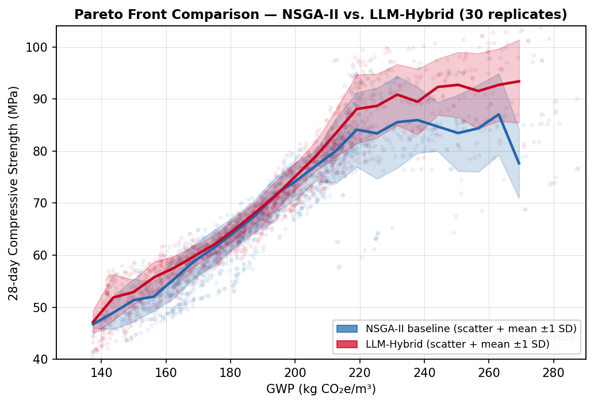

Scatter of all 1,500 final Pareto solutions per method. Lines show the binned mean of maximum achievable strength per GWP interval (±1 SD shaded). The hybrid extends the front toward lower GWP and higher strength at both extremes.

#### Convergence curves

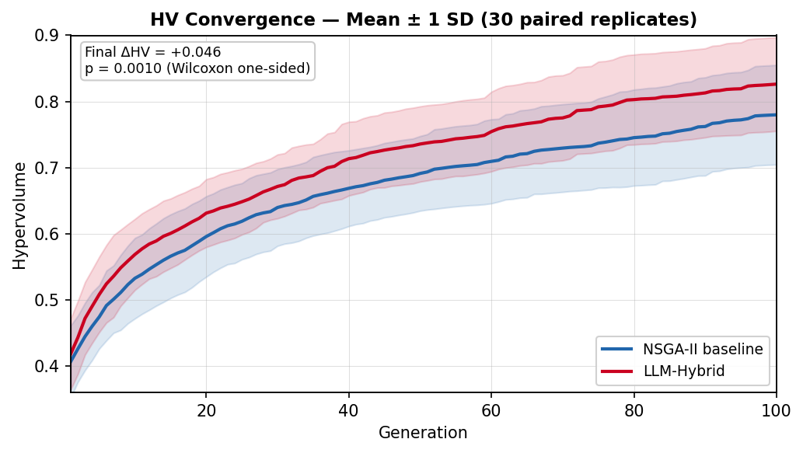

Mean HV ± 1 SD across 30 paired replicates. The hybrid maintains a positive lead from generation 1 onward.

#### Per-generation ΔHV increment

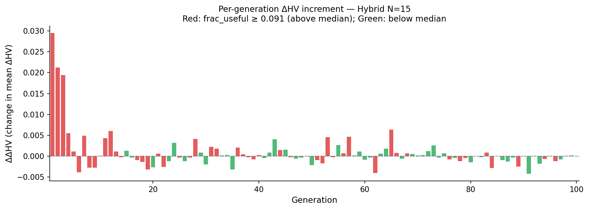

Change in mean ΔHV from one generation to the next. **Red bars**: LLM contributed above-average useful solutions at that generation (frac_useful > 13.8%); **green bars**: below-average. Red bars cluster in early generations when the Pareto front is sparse and easy to extend.

#### N-sweep: selecting N=15

N=15 was determined by a sweep of LLM solutions per generation (N = 5, 10, 15, 20, 25), each with 30 paired replicates. The table below shows ΔHV = HV(hybrid) − HV(baseline) for each N.

| N | Mean ΔHV vs baseline | SD | p (Wilcoxon, one-sided) | % reps improved |
|:--:|:--:|:--:|:--:|:--:|
| 5  | +0.046 | 0.079 | 0.001 (**) | 76% |
| 10 | +0.049 | 0.083 | 0.004 (**) | 70% |
| **15** | **+0.082** | 0.089 | **<0.001 (***)** | **83%** |
| 20 | +0.034 | 0.108 | 0.029 (*) | 66% |
| 25 | +0.062 | 0.095 | 0.001 (***) | 70% |

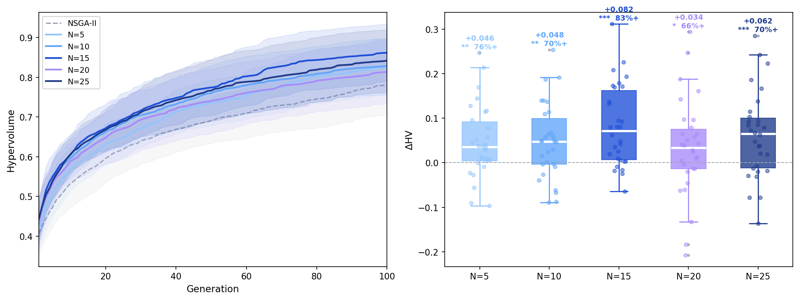

N=15 achieves the highest ΔHV (+0.082) and the highest fraction of improved replicates (83%). N=20 shows a notable drop despite a lower infeasibility rate (37% vs 46% at N=15): the larger batch floods the offspring pool with feasible-but-dominated solutions that displace genetic offspring in NSGA-II's crowding-distance selection. N=25 partially recovers but at higher variance. **N=15 was adopted as the main experiment configuration.**

---

### Step 2 — LLM Solution Quality

45,000 LLM solutions logged across 30 replicates (1,500 solutions per rep: 15 solutions × 100 generations).

| Quality Metric | Mean | SD |
|---------------|-----:|---:|
| Fraction feasible (all constraints satisfied) | 54.0% | 6.0% |
| Fraction non-dominated (vs. current front) | 19.5% | 3.0% |
| Fraction useful (feasible **and** non-dominated) | 10.5% | 2.2% |
| Median distance to Pareto front (normalized) | 0.010 | — |

#### LLM solution quality over generations

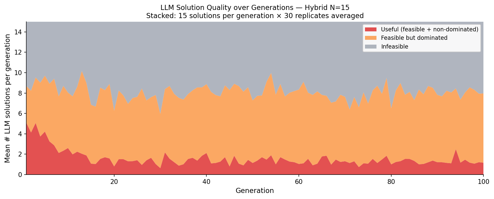

Each generation, 15 LLM solutions are injected. The stacked area shows their breakdown: useful (feasible and non-dominated, red), feasible but dominated (orange), and infeasible (grey). Quality peaks in early generations when the Pareto front is sparse, then declines as NSGA-II refines it.

**Correlations with per-replicate ΔHV** (n = 30):

| Predictor | r | p |
|-----------|--:|--:|
| Fraction non-dominated | +0.45 | 0.013 ★ |
| Fraction useful (feasible + non-dominated) | +0.38 | 0.041 ★ |
| Fraction feasible | +0.05 | 0.807 |

Replicates in which the LLM generated more non-dominated solutions showed larger HV improvement, confirming that the effect is mechanistic rather than coincidental.

---

### Step 3 — Pareto Front Diversity

**Diversity metric:** mean pairwise Euclidean distance between all solutions on the final Pareto front, computed in normalized objective space:

$$D = \frac{2}{n(n-1)} \sum_{i < j} \left\| \tilde{x}_i - \tilde{x}_j \right\|_2$$

where $\tilde{x}_i = \bigl(\frac{\text{GWP}_i - 169}{534.5 - 169},\; 1 - \frac{\text{str}_i - 17.4}{106.1 - 17.4}\bigr)$ normalizes each solution to [0, 1]². Larger *D* means solutions are spread more broadly across the trade-off curve.

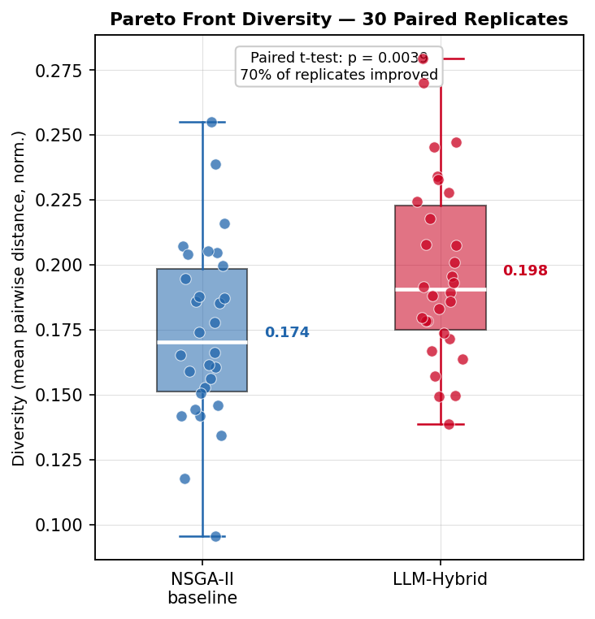

| | Baseline | Hybrid | Δ |
|--|:--------:|:------:|:-:|
| Mean diversity | 0.174 | 0.218 | **+0.044 (+25.4%)** |
| SD | 0.034 | 0.035 | — |
| % replicates with higher diversity | — | — | **83%** |

- Paired t-test (two-sided): t = 5.56, **p < 0.001**
- Wilcoxon (two-sided): W = 38, **p < 0.001**
- Correlation ΔDiversity vs ΔHV: **r = +0.680, p < 0.001**

LLM injection not only improves the hypervolume but also spreads the Pareto front more broadly across the GWP–strength trade-off space. Replicates with larger diversity gains also achieved larger HV gains.

---

### Step 4 — Ablation Study

Two ablation experiments isolate *what* drives the hybrid's HV gain.

#### Step 4.1 — Method Comparison

Four methods are compared at N=15 (30 paired replicates, every-gen augment, seed=rep):
- **NSGA-II** — pure evolutionary baseline, no LLM
- **Pure LLM** — LLM-only generation at each generation, no NSGA-II evolution
- **Hybrid Replace** — LLM solutions overwrite N offspring before NSGA-II selection
- **Hybrid Augment** — LLM solutions appended to the offspring pool; NSGA-II selection decides their fate

| Method | N | Mean HV | ΔHV vs NSGA-II | % Positive | p (Wilcoxon) |
|:--|:--:|:--:|:--:|:--:|:--:|
| NSGA-II (baseline) | — | 0.780 | — | — | — |
| Pure LLM | 15 | 0.599 | −0.181 | 0% | <0.001 (***) |
| Hybrid Replace | 15 | 0.802 | +0.023 | 56% | 0.299 (ns) |
| **Hybrid Augment** | **15** | **0.862** | **+0.082** | **83%** | **<0.001 (***)** |

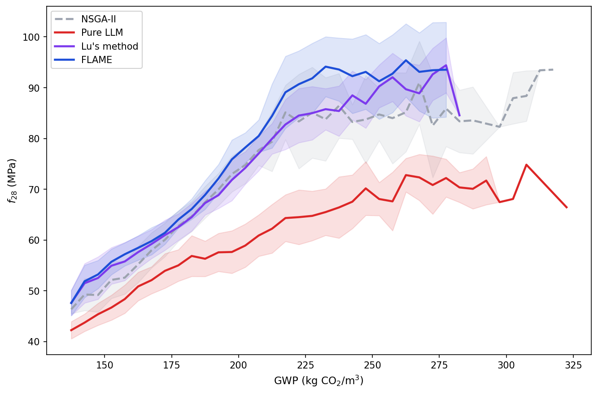

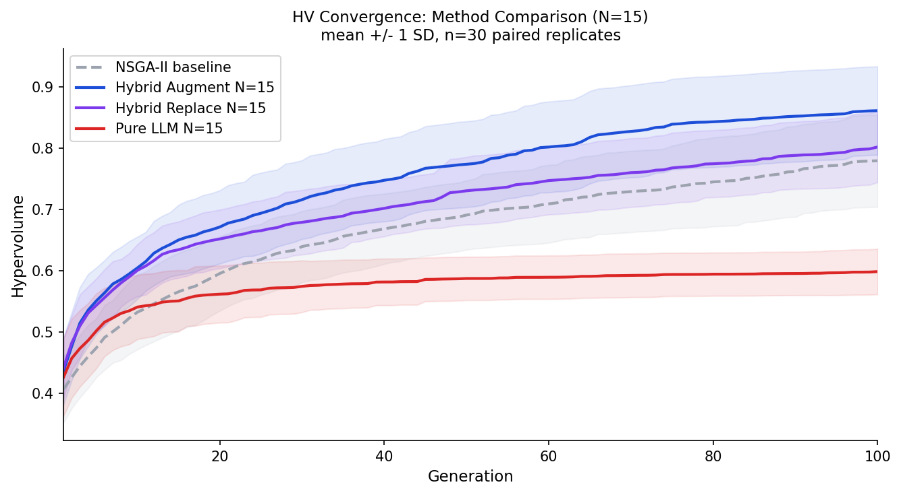

**Key findings:**
- **Pure LLM** collapses severely (ΔHV = −0.181, 0% improved): without NSGA-II's genetic operators and selection pressure, LLM-only search cannot maintain a competitive Pareto front. Evolutionary search is load-bearing.
- **Hybrid Replace** at N=15 is not statistically significant (p = 0.299, ns): replacing 15 of 50 offspring (30% of the pool) each generation is too aggressive. Injected LLM solutions displace NSGA-II's offspring before selection can filter them, disrupting crowding-distance diversity maintenance. At N=5, Replace had been marginally significant (ΔHV = +0.037, p = 0.006); the degradation at N=15 shows that replace mode does not scale.
- **Hybrid Augment** uniquely benefits from larger N: adding LLM solutions to the pool rather than replacing offspring lets NSGA-II's selection decide their fate, so quality solutions survive and poor ones are eliminated without harming genetic diversity.

#### Step 4.2 — Leave-One-Out Prompt Ablation

The full prompt has five sections (Objectives, Knowledge Table, Constraints, Elite solutions, Task/gap targeting). Each variant removes exactly one section at N=5 (30 paired replicates) to isolate prompt component effects from injection-count effects.

| Prompt condition | Mean HV | Mean ΔHV | p (Wilcoxon) | ΔHV loss* |
|:--|:--:|:--:|:--:|:--:|
| NSGA-II baseline | 0.780 | 0.000 | — | — |
| Full prompt | 0.826 | +0.046 | 0.002 (**) | — |
| w/o Objectives | 0.819 | +0.039 | 0.019 (*) | 0.007 |
| w/o Knowledge Table | 0.812 | +0.032 | 0.064 (ns) | 0.014 |
| w/o Constraints | 0.825 | +0.045 | 0.001 (***) | 0.001 |
| w/o Elite solutions | 0.816 | +0.036 | 0.028 (*) | 0.010 |
| w/o Task/Gap | 0.811 | +0.031 | 0.152 (ns) | 0.015 |

\* ΔHV loss = Mean ΔHV(full) − Mean ΔHV(ablated): how much HV gain is lost by removing that section.

**Knowledge Table effect on material composition:**

The Knowledge Table encodes GWP emission factors, strength mechanisms, and a two-path optimization strategy (high-slag for low GWP; low w/b + WR_HR for high strength). Removing it shifts the LLM toward less optimal binder strategies.

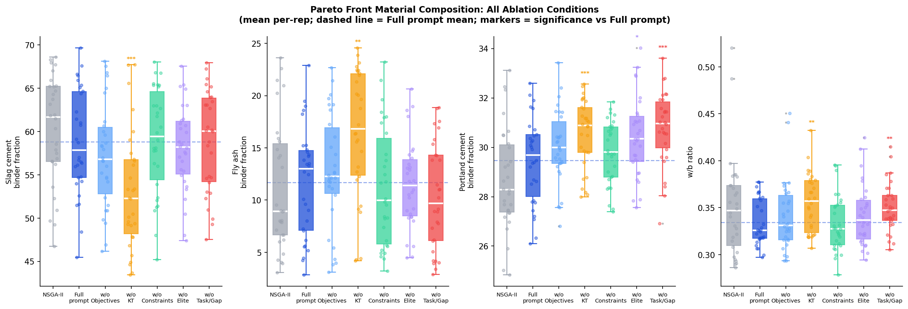

Pareto-front composition (mean per-replicate, vs Full prompt; paired t-test):

| Condition | SC% | FA% | PC% | w/b |
|:--|:--:|:--:|:--:|:--:|
| NSGA-II baseline | 60.2% | 11.1% | 28.7% | 0.350 |
| **Full prompt** | **58.8%** | **11.7%** | **29.5%** | **0.334** |
| w/o Objectives | 57.2% (ns) | 12.8% (ns) | 30.0% (ns) | 0.342 (ns) |
| **w/o Knowledge Table** | **53.0% (***)** | **16.4% (**)** | **30.6% (***)** | **0.355 (**)** |
| w/o Constraints | 59.0% (ns) | 11.2% (ns) | 29.8% (ns) | 0.333 (ns) |
| w/o Elite | 58.0% (ns) | 11.5% (ns) | 30.4% (*) | 0.342 (ns) |
| w/o Task/Gap | 58.9% (ns) | 10.3% (ns) | 30.8% (***) | 0.350 (**) |

Removing the Knowledge Table is the **only condition that significantly shifts the binder strategy**: SC drops 5.8 pp, FA rises 4.7 pp, and w/b increases 0.021 — all significant at p < 0.01. Removing any other prompt section leaves the material composition statistically unchanged. This confirms that KT is the sole source of actionable mix-design domain knowledge in the prompt: the LLM cannot infer the slag-first, low-w/b strategy from objectives or constraints alone.

**Elite solutions effect on LLM proposal quality:**

Elite solutions serve as few-shot examples showing the LLM what a non-dominated mix looks like. Without them, the LLM operates in zero-shot mode.

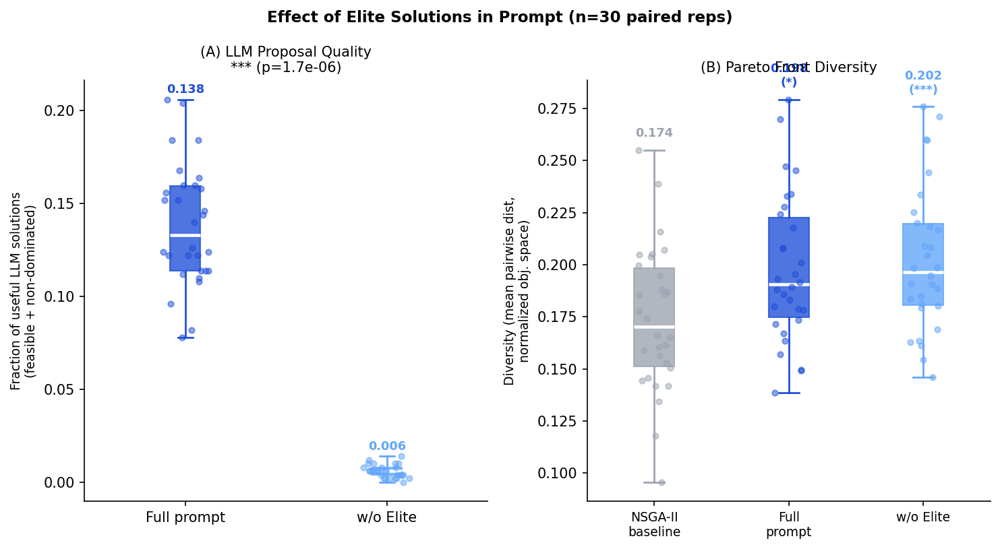

| Metric | Full prompt | w/o Elite | Δ | p |
|:--|:--:|:--:|:--:|:--:|
| Fraction of useful LLM proposals (feasible + non-dominated) | 13.8% | 0.59% | −13.2 pp | <0.001 (***) |
| Pareto front diversity | 0.198 | 0.203 | +0.005 | 0.299 (ns) |

Removing Elite solutions reduces useful LLM proposals by 95%: the LLM proposes solutions that are rarely competitive with the current Pareto front. Despite higher (but insignificant) diversity, the w/o Elite condition achieves lower ΔHV because solutions land far from the frontier — breadth without quality does not improve hypervolume.

---

### Step 5 — Physical Interpretation: GWP Drivers Across the Pareto Front

We pooled all 30 FLAME replicates into a global non-dominated set of **85 solutions** spanning GWP 137–278 kg CO₂/m³ and 28-day strength 46–103 MPa, and used Spearman rank correlation + OLS regression to identify what drives GWP variation across the full trade-off curve.

#### Key finding: total binder content, not SC substitution rate, dominates GWP

| Predictor | Spearman r_s | p | R² alone (OLS) |
|:--|:--:|:--:|:--:|
| Total binder content (PC+SC+FA, kg/m³) | **+0.994** | **<0.001** | **0.862** |
| Effective binder GWP factor (kg CO₂/kg binder) | −0.623 | <0.001 | 0.317 |
| SC substitution rate (%) | +0.367 | <0.001 | — |

Joint OLS (standardised GWP ~ binder + eff. GWP factor): **R² = 0.983**, β(binder) = +1.43 vs β(eff. GWP factor) = +0.61. **Binder quantity accounts for 86% of GWP variance; binder quality (SCM substitution) accounts for 32%.**

#### GWP vs total binder content

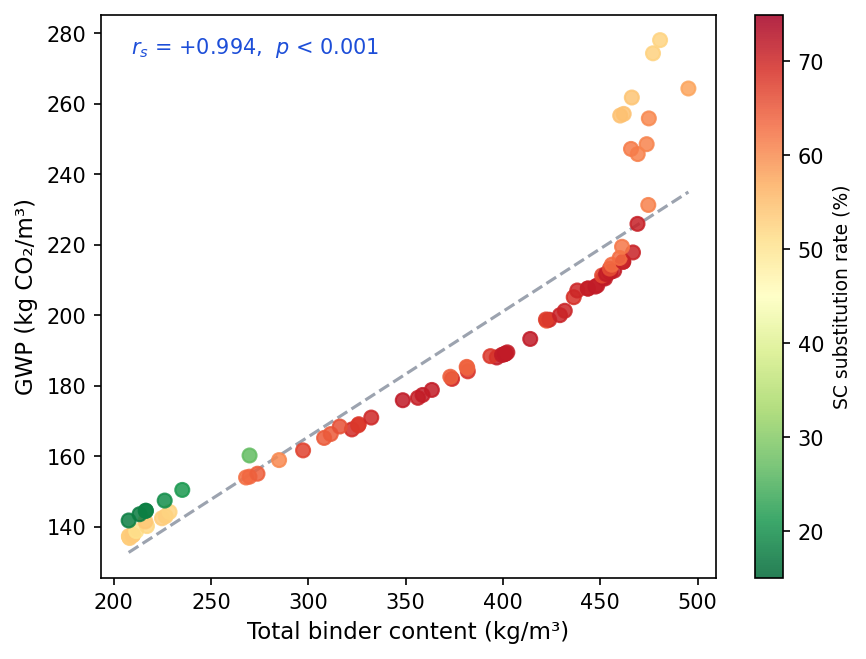

GWP vs total binder content (r_s = +0.994, p < 0.001), points coloured by SC substitution rate. The near-perfect rank correlation confirms total binder mass as the dominant GWP lever. Binder content alone accounts for 86% of GWP variance (OLS R² = 0.862), versus 32% for the effective binder GWP factor (which captures SCM substitution rate).

**Practical implication:** at moderate-to-high strength targets, reducing total cementitious content (lean-binder strategy, higher w/b) is a more effective GWP lever than maximising SC substitution rate. Maximising SC% is appropriate only when very high strength requires a low w/b.

---

## Evaluation Metrics

### HV — Hypervolume

Measures the volume of objective space dominated by the Pareto front, relative to a fixed reference point [1,1] in normalized space.

- GWP: normalized to [0,1] over [169, 534.5] kg CO₂/m³
- Strength: inverted and normalized to [0,1] over [17.4, 106.1] MPa

Larger HV = front pushes further toward low GWP **and** high strength simultaneously.

### ΔHV = HV(hybrid) − HV(baseline)

Primary outcome variable. Positive = hybrid outperforms the paired baseline sharing the same random seed.

### Diversity

Average pairwise Euclidean distance between all Pareto front solutions in normalized objective space. Higher diversity = broader coverage of the trade-off curve.

---

## Repository Structure

```
├── optimizer_core_mt.py          # Core NSGA-II optimizer (constraints, bounds, physics)
├── optimizer_hybrid_mt.py        # LLM-augmented NSGA-II hybrid
├── run_grid_late_mt.py           # Runner for grid_everyg experiments
├── run_nsweep_mt.py              # N-sweep runner (N=5,10,15,20,25, 30 reps each)
├── run_ablation_mt.py            # Step 4.2 LOO prompt ablation runner
├── run_abl41_n15.py              # Step 4.1 method comparison runner at N=15
├── regen_figures_n15.py          # Regenerate Steps 1–3 figures from N=15 data
├── analyze_nsweep_final.py       # N-sweep analysis figure (Step 1 N-sweep)
├── analyze_step42.py             # Step 4.2 composition + elite effect figures
├── analyze_pareto_gwp.py         # Step 5: GWP decomposition (Spearman + OLS across global Pareto front)
├── Concrete_Data_SI_clean.csv    # Dataset (756 mixes filtered by Vfinal, kg/m³)
├── results/
│   ├── figures/                  # Figures for README
│   │   ├── pareto_front_everyg.png
│   │   ├── convergence_everyg.png
│   │   ├── delta_hv_incremental_everyg.png
│   │   ├── step2_area.png
│   │   ├── step3_paired.png
│   │   ├── nsweep_final.png          # N-sweep ΔHV comparison (Step 1)
│   │   ├── step42_composition.png    # Material composition: full vs w/o KT
│   │   ├── step42_elite_effect.png   # frac_useful + diversity: full vs w/o Elite
│   │   └── pareto_gwp_decomposition.png  # Step 5: GWP vs binder content + GWP vs SC%
│   ├── nsweep_n{05,10,15,20,25}_rep{01-30}/  # N-sweep hybrid runs
│   ├── grid_everyg_hyb_rep{01-30}/   # N=5 hybrid runs (reused as N=5 in N-sweep)
│   ├── grid_everyg_base_rep{01-30}/  # Baseline NSGA-II runs (shared across experiments)
│   ├── abl41_purellm_n15_rep{01-30}/ # Step 4.1: pure-LLM N=15 runs
│   ├── abl41_replace_n15_rep{01-30}/ # Step 4.1: hybrid replace N=15 runs
│   └── abl42_no_{obj,kt,con,elite,task}_rep{01-30}/  # Step 4.2: LOO ablation runs
└── README.md
```

---

## Setup and Usage

### Installation

```bash
pip install pymoo catboost joblib google-genai python-dotenv pandas numpy scipy matplotlib
```

Create a `.env` file in the project root:
```
GEMINI_API_KEY=your_key_here
```

### Run grid_everyg (30 paired replicates)

```bash
python run_grid_late_mt.py --mode late --start-gen 0 --inject-mode augment \
    --prefix grid_everyg --repeat 30 --rep-start 1
```

### Analyze results (Steps 1–3)

```bash
python analyze_grid_gap.py --prefix grid_everyg --reps 30
```

### Run ablation study (Step 4)

```bash
python run_ablation_mt.py --study all --repeat 10
```

---

## Related Work

This project extends LLM-augmented optimization to the multi-objective setting, benchmarking a Gemini-powered NSGA-II hybrid against a pure evolutionary baseline.

Companion project: [`low_carbon_concrete`](../low_carbon_concrete) — single-objective LLM optimizer (minimize GWP with a 28d strength constraint).
