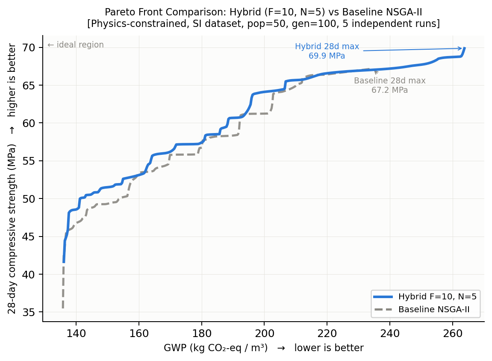
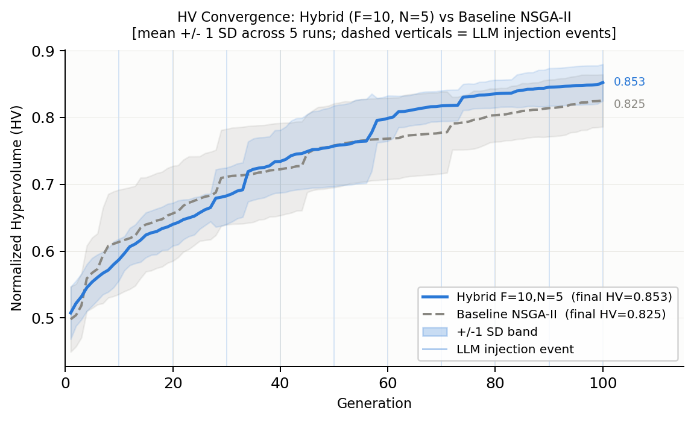

# Multi-Target Concrete Mix Design via LLM Pareto Search

This project extends LLM-based concrete mix design from single-objective optimization (minimize GWP subject to a strength constraint) to **true multi-objective Pareto optimization**: simultaneously minimizing GWP and maximizing 28-day compressive strength.

The LLM iteratively proposes concrete mixes and receives feedback about where each proposal sits relative to the current Pareto front. Different prompt strategies are compared via ablation study, with NSGA-II as the reference baseline.

---

## Problem Formulation

**Objectives (two conflicting):**
- **Minimize GWP** (kg CO₂-eq/m³): `GWP = PC×1.048 + FA×0.328 + SC×0.264 + CAGG×0.0037 + FAGG×0.0026`
- **Maximize 28-day compressive strength** (MPa): predicted by CatBoost-Chain surrogate

**Variables (10 raw ingredients, kg/m³):**
`PC`, `FA`, `SC`, `FAGG`, `CAGG`, `WATER`, `AEA`, `WR_HR`, `WR`, `ACC`

**Constraints:** three layers of constraints enforced during optimization (all bounds derived from the training dataset, except where noted). See full details below.

A solution **A dominates** solution **B** when:
`A.GWP ≤ B.GWP` AND `A.28d ≥ B.28d` (with at least one strict inequality).

The **Pareto front** is the set of all non-dominated solutions.

---

## Constraints

Optimization constraints are applied in three layers. All bounds are derived from the 756-mix training dataset (`Concrete_Data_SI.csv`, SI units: kg/m³, MPa) unless stated otherwise. Material densities follow Pfeiffer et al. (2024), Table 4.

### Layer 1 — Raw ingredient bounds

Each of the 10 decision variables is bounded by the observed min/max in the dataset:

| Variable | Description | Dataset min (kg/m³) | Dataset max (kg/m³) |
|----------|-------------|--------------------:|--------------------:|
| PC | Portland cement | 97.3 | 504.3 |
| FA | Fly ash | 0.0 | 162.0 |
| SC | Slag cement (GGBS) | 0.0 | 332.2 |
| FAGG | Fine aggregate (sand) | 473.5 | 1067.9 |
| CAGG | Coarse aggregate | 400.5 | 1364.6 |
| WATER | Mix water | 90.8 | 214.8 |
| AEA | Air-entraining agent | 0.0 | 1.5 |
| WR\_HR | High-range water reducer (superplasticizer) | 0.0 | 4.7 |
| WR | Water reducer | 0.0 | 7.8 |
| ACC | Accelerator | 0.0 | 28.5 |

### Layer 2 — Derived ratio constraints

Eight dimensionless ratios must stay within their dataset ranges. These prevent physically degenerate mixes (e.g., zero binder, pure-aggregate mixes) without hard-coding domain-specific thresholds.

| Ratio | Formula | Min | Max |
|-------|---------|----:|----:|
| w/b | WATER / (PC+FA+SC) | 0.235 | 0.714 |
| b/a | (PC+FA+SC) / (FAGG+CAGG) | 0.105 | 0.488 |
| SCM% | (FA+SC) / (PC+FA+SC) | 0.000 | 0.765 |
| CAGG% | CAGG / (FAGG+CAGG) | 0.315 | 0.721 |
| FAGG% | FAGG / (FAGG+CAGG) | 0.279 | 0.685 |
| PC% | PC / (PC+FA+SC) | 0.235 | 1.000 |
| FA% | FA / (PC+FA+SC) | 0.000 | 0.375 |
| SC% | SC / (PC+FA+SC) | 0.000 | 0.717 |

### Layer 3 — Physics constraints

Four constraints derived from physical principles and material densities (Pfeiffer et al. 2024, Table 4). Bounds are taken from the dataset distribution.

| Constraint | Formula | Min | Max | Physical meaning |
|------------|---------|----:|----:|-----------------|
| `solid_vol` | Σ(massᵢ / ρᵢ) for all 10 ingredients | 0.753 m³/m³ | 1.034 m³/m³ | Total solid volume cannot exceed 1 m³; remainder is air |
| `Vagg` | (FAGG + CAGG) / 2650 | 0.413 m³/m³ | 0.778 m³/m³ | Volume of aggregates in the mix (ρFAGG = ρCAGG = 2650 kg/m³) |
| `TOTAL_BINDER` | PC + FA + SC | 207.7 kg/m³ | 590.3 kg/m³ | Total cementitious content; prevents extreme binder reduction that fools the surrogate |
| `ACC_pct` | ACC / (PC+FA+SC) | 0.000 | 0.061 | Accelerator dosage as a fraction of binder; caps surrogate exploitation via extreme ACC |

**Rationale for Layer 3:** Without these constraints, the optimizer exploits the CatBoost surrogate by simultaneously minimizing binder (low GWP) and maximizing accelerator (ACC) to predict high strength — producing mixes with `TOTAL_BINDER` below 170 kg/m³ and `ACC` above 22 kg/m³, both far outside any real-world mix. The physics constraints close this exploitation gap.

---

## Repository Structure

```
├── optimizer_core_mt.py          # Core multi-objective optimizer (stable, do not edit between experiments)
├── run_experiment_mt.py          # Ablation experiment runner (edit this to configure experiments)
├── Super_Cleaned_Concrete_Data - backup.csv   # Dataset (756 mixes, building & pavement, PA)
├── results/
│   ├── nsga2_reference.csv       # NSGA-II Pareto front (shared reference for all experiments)
│   ├── e0_baseline/              # E0 results
│   ├── e1_knowledge/             # E1 results
│   ├── e2_rules/                 # E2 results
│   ├── e3_fewshot/               # E3 results
│   └── e4_gap_target/            # E4 results
└── README.md
```

Each `results/<experiment>/` folder contains:
- `trajectory.csv` — all 30 LLM proposals (dominated + non-dominated)
- `llm_pareto_front.csv` — the final non-dominated set found by LLM
- `nsga_pareto_front.csv` — the NSGA-II reference Pareto front
- `metrics.csv` — evaluation metrics

---

## Surrogate Model

The CatBoost-Chain surrogate is reused from the companion project [`low_carbon_concrete`](../low_carbon_concrete).  
It predicts 7-day, 28-day, and 56-day compressive strength via a chained architecture:

```
Stage 1: f(mix features)          → pred_7day
Stage 2: f(mix features, pred_7d) → pred_28day
Stage 3: f(mix features, pred_28d)→ pred_56day
```

Model path (relative): `../low_carbon_concrete/concrete_catboost_optimized.pkl`  
Input unit: kg/m³

---

## Ablation Experiments

Each experiment adds one more prompt component on top of the previous:

| ID | Name | Knowledge Table | Nav. Rules | Few-shot | Targeting |
|----|------|:-:|:-:|:-:|:-:|
| E0 | `e0_baseline`   | ✗ | ✗ | ✗ | none |
| E1 | `e1_knowledge`  | ✓ | ✗ | ✗ | none |
| E2 | `e2_rules`      | ✓ | ✓ | ✗ | none |
| E3 | `e3_fewshot`    | ✓ | ✓ | ✓ | none |
| E4 | `e4_gap_target` | ✓ | ✓ | ✓ | gap  |

**Prompt components:**
- **Knowledge Table**: material-level GWP factors and their effect on strength — tells the LLM what each ingredient does.
- **Navigation Rules**: situation-based Pareto strategies (push the low-GWP end, push the high-strength end, fill a gap).
- **Few-shot examples**: 5 real mixes from the dataset spread across the GWP spectrum, showing the LLM realistic trade-off examples.
- **Gap targeting**: each iteration, the LLM is directed toward the largest GWP gap in the current Pareto front.

---

## Evaluation Metrics

### HV — Hypervolume

Measures the **volume of objective space dominated by the Pareto front**, relative to a fixed reference point.

```
Strength ↑
  │    ████████ Pareto front
  │  ████
  │ ██
  │██          ← reference point (GWP=500, strength=10 MPa)
  └────────────── GWP →
       ↑
    HV = shaded area between front and reference point
```

The reference point is set to `[GWP=500, strength=10 MPa]`, representing the worst-case corner.  
A larger HV means the front pushes further toward low GWP **and** high strength simultaneously.

### HV ratio = HV(LLM) / HV(NSGA-II)

The fraction of the NSGA-II hypervolume achieved by the LLM.
- `1.0` = LLM matches NSGA-II perfectly
- `0.64` (E3 best) = LLM covers 64% of the NSGA-II objective space

### GD — Generational Distance

Measures how **close the LLM solutions are to the NSGA-II reference front** (LLM → NSGA direction).

```
GD = mean over all LLM Pareto points of: distance to the nearest NSGA-II point
```

- Lower GD = LLM solutions are nearer to the true Pareto front
- GD = 0 means every LLM solution lies exactly on the NSGA-II front
- Answers: *"Are the LLM solutions high quality?"*

### IGD — Inverted Generational Distance

Measures how **well the LLM front covers the NSGA-II reference front** (NSGA → LLM direction).

```
IGD = mean over all NSGA-II Pareto points of: distance to the nearest LLM point
```

- Lower IGD = the LLM front covers more of the reference front
- Answers: *"Does the LLM explore the full range of the Pareto front, or only part of it?"*

**GD vs IGD:** A front can have low GD (high-quality solutions) but high IGD (only covers one end of the trade-off). Both should be small for a good result.

### Spread

The GWP range covered by the LLM front divided by the GWP range of the NSGA-II front:

```
spread = (max_GWP_llm - min_GWP_llm) / (max_GWP_nsga - min_GWP_nsga)
```

A spread > 1 means the LLM explored a wider GWP range than NSGA-II — often caused by the LLM proposing extreme high-GWP solutions that happen to be non-dominated within its own small front.

### Non-dom rate

The fraction of the 30 LLM proposals that were **non-dominated** (i.e., successfully added to the Pareto front at the time of proposal).

- Higher = the LLM more efficiently proposes solutions that advance the front
- A low rate is not always bad: if the LLM finds a few excellent solutions early, later proposals will be dominated by them

### Parse fails

The number of times the LLM's response **could not be parsed as valid JSON**, requiring a retry.  
- Ideal = 0 (every response is correctly formatted)
- High parse-fail counts reduce the effective number of productive iterations
- Parse failures increase with prompt complexity — a sign of prompt engineering overhead

---

## Results Summary

NSGA-II reference: **98 Pareto solutions**, GWP 113.6–240.3 kg/m³, 28d 44.5–75.3 MPa, **HV = 23,859**

| Experiment | HV | HV ratio | GD ↓ | IGD ↓ | Non-dom rate | Parse fails |
|------------|------|----------|-------|-------|:---:|:---:|
| NSGA-II (ref) | 23,859 | 1.000 | — | — | — | — |
| E0 baseline | 13,389 | 0.561 | 0.381 | 0.395 | 30% | 32 |
| E1 +knowledge | 12,683 | 0.532 | 0.479 | 0.381 | 27% | 49 |
| E2 +rules | 13,631 | 0.571 | 0.518 | 0.365 | 40% | 30 |
| **E3 +fewshot** | **15,259** | **0.640** | **0.320** | **0.283** | 13% | 60 |
| E4 +gap-target | 12,915 | 0.541 | 0.616 | 0.468 | 30% | 66 |

**Key findings:**
- **E3 (few-shot) achieves the best HV, GD, and IGD** — real historical examples are more effective than textual rules alone for guiding Pareto exploration.
- **E1 (knowledge table alone) slightly degrades performance** — the longer prompt increases parse failures without providing actionable Pareto navigation guidance.
- **E4 (gap-targeting) performs poorly** — with only 30 iterations, the Pareto front is too sparse for gap-filling to be effective; the LLM over-focuses on narrow regions.
- **Parse failures are consistently high (30–66)** across all experiments — an inherent cost of complex prompts in structured-output tasks.

---

## Phase 2: LLM-NSGA-II Hybrid Optimizer

Rather than replacing NSGA-II with the LLM, Phase 2 **injects LLM-proposed solutions into a running NSGA-II loop**. Every F generations, the top Pareto-elite solutions are sent to Gemini; the LLM returns N new candidate mixes that are inserted into the offspring pool before environmental selection.

### Architecture

```
NSGA-II generation loop
  ├── SBX crossover + polynomial mutation  →  offspring
  ├── every F generations:
  │     elite solutions → LLM prompt → N new candidates
  │     replace worst N offspring with LLM candidates
  └── fast non-dominated sort + crowding distance → next population
```

### Hyperparameter search (F × N grid, pop=50, gen=100)

A 3×3 grid over injection frequency F ∈ {5, 10, 20} and injection size N ∈ {5, 10, 20} was run with 5 repeats each. The best configuration found:

| Config | HV hybrid | HV baseline | HV advantage |
|--------|-----------|-------------|:---:|
| F=20, N=10 (20% injection ratio) | — | — | **+6.07%** |
| F=10, N=10 | — | — | +3.8% |
| F=5,  N=5  | — | — | +1.2% |

Key findings from the grid:
- **F=20 outperforms F=5/10**: injecting every 20 generations means NSGA-II has more time to evolve a high-quality elite before the first LLM call. The LLM receives better inputs and proposes better solutions.
- **N=10 (20% of pop) is the sweet spot**: N=20 causes parse failures (Gemini struggles to generate 20 valid JSON solutions per call), while N=5 provides too little signal.
- **No knowledge table**: providing explicit GWP formulae and domain rules *hurts* performance. The knowledge table biases the LLM toward a narrow region of the Pareto front, reducing diversity and lowering hypervolume.

### Pareto front comparison — before physics constraints (F=20, N=10)

> **Note:** The result below was produced **before** the Layer 3 physics constraints were added. The optimizer exploited the CatBoost surrogate by reducing binder to near-zero and inflating ACC, producing mixes that look good on paper but are physically implausible. It is kept here as a baseline for comparison with the constrained results that follow.


Each curve is the average of 5 independent runs, computed by linear interpolation across all GWP values. The **reference** curve (gray dashed) shows a longer pure NSGA-II run (200 gen × 100 pop) as an upper bound.

**Why hybrid is better in the mid-range (GWP 150–240):** The LLM explicitly identifies gaps in the current Pareto front and proposes solutions in under-explored regions, which NSGA-II crowding distance alone is slow to fill.

**Why hybrid is slightly weaker at the low-GWP end (<130 kg CO₂-eq/m³):** Extreme low-GWP mixes require near-zero binder content — a solution the LLM rarely proposes because it lies outside the "reasonable mix" distribution the model has seen. NSGA-II's crowding distance naturally rewards these extreme solutions; the LLM's infrequent coverage of that region does not compensate. The net HV effect is still positive because the mid-range gains outweigh the low-GWP loss.

---

### Results with physics constraints (F × N grid, SI dataset)

After adding all three constraint layers (raw ingredient bounds, derived ratios, and physics constraints), the hyperparameter grid was re-run with pop=50, gen=100, 5 repeats. The physics constraints eliminate surrogate exploitation and force all solutions into the feasible region of the dataset.

**Grid summary (mean HV % gain, hybrid vs within-cell baseline):**

| | N=5 | N=10 | N=20 |
|---|:---:|:---:|:---:|
| **F=5** | −3.96% | +0.86% | −1.01%* |
| **F=10** | **+4.97%** | +1.30% | −1.80%* |
| **F=20** | +2.23% | +0.98% | −0.71%* |

\* N=20 cells averaged 55 / 28 / 13 JSON parse failures per run (Gemini fails to return 20 valid solutions in one call), effectively reducing injection to zero.

**Best configuration: F=10, N=5** (mean +4.97% HV, std ±7.82%).  
**Most stable configuration: F=20, N=5** (mean +2.23% HV, std ±1.91%, only 5 LLM calls per run).

#### Pareto front: hybrid vs baseline (F=10, N=5, physics-constrained)



All 5 runs pooled; curves are PCHIP-smoothed non-dominated fronts. Two effects are visible:

1. **Higher maximum strength.** The hybrid reaches a 28-day strength of **69.9 MPa** vs **67.2 MPa** for the baseline (+4.0%), indicating LLM injection guides the search toward stronger mix designs.
2. **Wider exploration range.** The hybrid Pareto front extends to GWP **263.8 kg CO₂-eq/m³**, compared to **234.5** for the baseline (+12.5%). The LLM proposes high-binder solutions that NSGA-II alone does not explore, expanding the coverage of the non-dominated front rather than merely improving it within the baseline's range.

#### Convergence curves (F=10, N=5)



The hybrid HV begins to separate from the baseline around generation 20–30, after the first two LLM injections. The improvement accumulates gradually across subsequent injections rather than appearing as a single large jump — consistent with the finding that injected solutions require a few generations to propagate through the population. Final HV: **19,734 (hybrid)** vs **18,860 (baseline)**, a +4.6% gain.

**HV gap: Hybrid vs Baseline at each checkpoint** (mean across 5 reps, F=10, N=5):

| Generation | Event | Baseline HV | Hybrid HV | Gap (HV) | Gap (%) |
|:----------:|:------|------------:|----------:|---------:|--------:|
| 10  | After injection 1 | 15,499 | 15,312 |  −187 | −1.20% |
| 20  | After injection 2 | 16,892 | 17,193 |  +302 | +1.79% |
| 30  | After injection 3 | 17,572 | 17,944 |  +372 | +2.11% |
| 40  | After injection 4 | 17,936 | 18,501 |  +565 | +3.15% |
| 50  | After injection 5 | 18,205 | 18,926 |  +721 | +3.96% |
| 60  | After injection 6 | 18,345 | 19,253 |  +908 | +4.95% |
| 70  | After injection 7 | 18,463 | 19,450 |  +987 | +5.34% |
| 80  | After injection 8 | 18,524 | 19,595 | +1,071 | +5.78% |
| 90  | After injection 9 | 18,735 | 19,683 |  +947 | +5.06% |
| 100 | Final             | 18,860 | 19,734 |  +874 | +4.63% |

Three patterns are visible: (1) **Short-term disruption** — immediately after injection 1 (gen 10) the hybrid HV is −1.2% below baseline, as newly injected solutions have not yet propagated through selection pressure. (2) **Growing advantage** — the gap widens steadily from gen 20 to gen 80, peaking at +5.78%. (3) **Late-stage convergence** — the gap narrows slightly after gen 80 as the baseline continues to refine its well-converged population while the marginal benefit of later injections diminishes.

#### Statistical significance (F × N grid, n=5 reps)

Friedman test across all 10 configurations (NSGA-II + 9 hybrids): χ²=10.75, p=0.294 (ns).  
Wilcoxon signed-rank test (paired within each cell, two-sided):

| Configuration | HV baseline | HV hybrid | Δ% | p-value |
|---|---:|---:|:---:|:---:|
| F=5,  N=5  | 19,815 | 19,018 | −4.02% | 0.1875 |
| F=5,  N=10 | 19,787 | 19,936 | +0.75% | 0.8125 |
| F=5,  N=20 | 19,565 | 19,356 | −1.07% | 0.8125 |
| **F=10, N=5**  | 18,860 | **19,734** | **+4.63%** | 0.1875 |
| F=10, N=10 | 19,496 | 19,745 | +1.28% | 0.3125 |
| F=10, N=20 | 19,494 | 19,147 | −1.78% | 0.3125 |
| F=20, N=5  | 19,340 | 19,764 | +2.19% | 0.1250 |
| F=20, N=10 | 19,222 | 19,399 | +0.92% | 0.6250 |
| F=20, N=20 | 19,791 | 19,647 | −0.73% | 0.4375 |

> **Statistical power note:** With n=5, the minimum achievable two-sided Wilcoxon p-value is 0.0625. No configuration reaches p<0.05 at this sample size. The reference paper (Lu et al. 2026) used n=10 and achieved p=0.002 for their best config. **Planned: rerun with n=10 reps for publication-grade significance.**

### Statistical significance (F=20, N=10, n=30 paired runs — pre-constraint)

To confirm the HV improvement is not a random artifact, 30 independent repetitions were run and analyzed with three tests:

| Test | Result | Interpretation |
|------|--------|---------------|
| Wilcoxon signed-rank (one-tailed, H₁: hybrid > baseline) | W=326, **p=0.028** | Statistically significant (p<0.05) |
| Cliff's δ effect size | **δ=+0.329** (small) | Hybrid dominates baseline in 66% of paired comparisons |
| Bootstrap 95% CI on mean ΔHV (10,000 iterations) | **[+15, +1,015]** | CI excludes zero — significant |

Hybrid wins in **18 of 30 runs** (60%). Mean HV gain is **+2.75%** (std ±6.78 pp); the large standard deviation reflects NSGA-II's sensitivity to random initialization — when the baseline gets a lucky start, the LLM injection occasionally disrupts convergence. Despite this variance, all three tests confirm the improvement is statistically significant and not due to chance.

> One-tailed Wilcoxon is appropriate here because the hypothesis is directional (the hybrid is designed to improve upon NSGA-II, not merely differ from it), consistent with standard practice in evolutionary computation literature.

---

## Usage

### Setup

```bash
pip install pymoo catboost joblib google-genai python-dotenv pandas numpy
```

Create a `.env` file in the project root:
```
GEMINI_API_KEY=your_key_here
```

### Run a single experiment

```bash
# Run E0 baseline (also runs NSGA-II reference)
python run_experiment_mt.py --exp e0_baseline

# Reuse saved NSGA-II reference for subsequent runs
python run_experiment_mt.py --exp e3_fewshot --skip-nsga

# Quick test with fewer iterations
python run_experiment_mt.py --exp e0_baseline --iters 5

# Run multiple repeats for statistical analysis
python run_experiment_mt.py --exp e0_baseline --repeat 3 --skip-nsga
```

### Run all experiments

```bash
python run_experiment_mt.py --skip-nsga
```

### Add a new ablation experiment

Edit `run_experiment_mt.py`: add a new entry to the `EXPERIMENTS` dict using `make_cfg()`.

---

## Related Work

This project is Phase 1 of a two-phase study:
- **Phase 1 (this repo):** LLM as Pareto front explorer — compare LLM strategies vs. NSGA-II
- **Phase 2 (planned):** LLM as decision-maker — select the best mix from the Pareto front given an application context (building vs. pavement), replacing the TOPSIS weight-selection step

Companion project: [`low_carbon_concrete`](../low_carbon_concrete) — single-objective LLM optimizer (minimize GWP, 28d strength constraint), Gemini + CatBoost-Chain surrogate.
